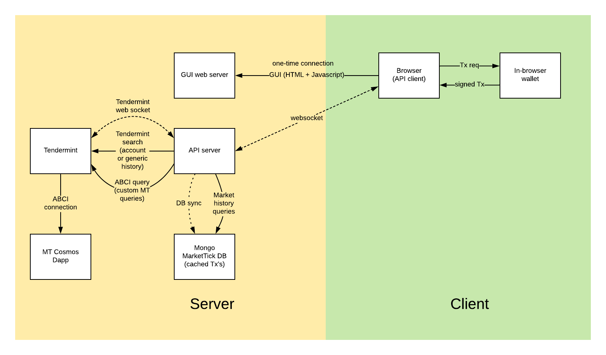

# Microtick API

This API runs as a custom protocol through a single websocket connection between client and server.  On the server
side, the connection is handled differently depending on the request type:

  - websocket to Tendermint (new block notifications)
  - MongoDB (search, history)
  - REST to Tendermint ABCI query (cosmos queries, transactions)

The server side complexity is hidden from the client app through the protocol which makes it simple to develop
Microtick trading bots and market makers.



## API Server

To run the API server, cd into the 'server' directory and execute the following commands (default websocket port is 1320)

```
$ cd server
$ yarn install
$ node server.js
```

## Client API Documentation

### Installation

```
npm install microtick
```

### Usage

```
const API = require('microtick')
const api = new API("http://localhost:1320")  // Assumes the API server is running on port 1320
```

The first step after creating the api object is to initialize the API with signing keys. You have two choices:
either initialize with no keys (in which case a new wallet will be created) or initialize with existing keys
(to use a specific wallet address and keys)

#### Initialization with signing keys

To create a new wallet:

```
await api.init()
const wallet = api.getWallet()
```

The returned wallet will contain your address and unencrypted public / private keys. ** You are responsible
for encrypting and safely storing your wallet keys **

To reuse an existing wallet:

```
await api.init(wallet)
```

where the wallet object is a previously returned object from api.getWallet()

#### API Function calls

##### Subscriptions

Subscriptions are handled by adding one or more event handler functions. The three
types of event handlers are Block events, Tick events and Account events.

Block updates are delivered automatically when the client connects to the API server.
```
api.addBlockHandler(block => {
    // block is a JSON object { height, time, hash, chainid }
})

```

Tick events must be subscribed to. Any number of subscriptions can be active simultaneously.
```
api.addTickHandler((market, tick) => {
    // market is a string, tick contains the tick data { height, time, consensus }
})
```

Account events are delivered automatically. Possible account events are: deposit,
withdraw, quote.cancel, quote.create, quote.deposit, quote.update, quote.withdraw,
trade.long, trade.short, settle.long, settle.short and settle.finalize.
```
api.addAccountHandler((key, data) => {
    // Key is th event type, data is the event data
}
```

```
await api.subscribe(market)
```

- market - market identifier (ETHUSD, XBTUSD, etc)

##### Unsubscribe

```
await api.unsubscribe(market)
```

- market - market identifier (ETHUSD, XBTUSD, etc)

##### Get Block Info

```
const block = await api.blockInfo()
```

returns the current block height and time

##### Get Block

```
const block = await api.getBlock(height)
```

- height - Tendermint block height

##### Get Account Info

```
const info = await api.getAccountInfo(addr)
```

- addr - cosmos address of account

##### Get Market Info

```
const info = await api.getMarketInfo(market)
```

- market - Microtick market name, i.e. "ATOMUSD"

##### Get Orderbook Info

```
const info = await api.getOrderbookInfo(market, duration)
```

- market - Microtick market name
- duration - Microtick duration, i.e. ('5minute', '10minute', '15minute', '30minute', '1hour', '2hour', '4hour', '8hour', '12hour', '24hour')

##### Get Market Spot

```
const info = await api.getMarketSpot(market)
```

returns an abbreviated object containing consensus price and overview information on a Microtick market

##### Get Live Quote

```
const quote = await api.getLiveQuote(id)
```

- id - quote id to fetch

##### Can Modify

```
const canModify = await api.canModify(id)
```

- id - quote id 

returns a boolean value, **true** if the quote can be modified, **false** if not.  Quotes can not be modified
for immediately, there is a settling time that is specified in the genesis block parameters.

##### Get Live Trade

```
const trade = await api.getLiveTrade(id)
```

- id - trade id to fetch

##### Get Historical Quote

```
const quote = await api.getHisoricalQuote(id, startBlock, endBlock)
```

- id - quote id to fetch
- startBlock, endBlock - optional, if supplied startBlock and endBlock specify
the range for historical quote updates to be retrieved

##### Get Historical Trade

```
const trade = await api.getHistoricalTrade(id)
```

- id - trade id to fetch

##### Account Sync

```
api.accountSync(startBlock, endBlock)
```

- startBlock, endBlock - range of historical account events to sync with, for
example a GUI may want the active trades up to the last 12 hours.

##### Account Ledger

```
const ledger = api.accountLedger(page, perPage)
```

Returns an array of ledger entries for an account.  Page is the page number
to be fetched and perPage is the number of entries per page.  Use with
api.accountLedgerSize() which returns the total number of account events.

##### Market History

```
const history = api.marketHistory(market, startBlock, endBlock, target)
```

- market - market id 
- startBlock, endBlock - range to query historical tick data for
- target - (optional) if supplied, specifies the number of ticks desired. the
function will interpolate the results if there are many more ticks than desired.

##### Create Market

```
await api.createMarket(market)
```

- market - market string, i.e. "ATOMUSD"

Create a new market

##### Create Quote

```
const id = await api.createQuote(market, duration, backing, spot, premium)
```

- market - market string, i.e. "ATOMUSD"
- duration - Microtick duration, i.e. ('5minute', '10minute', '15minute', '30minute', '1hour', '2hour', '4hour', '8hour', '12hour', '24hour')
- backing - token amount, i.e. "10dai"
- spot - spot value, i.e. "3.5spot
- premium - option premium requested, i.e. "1premium"

Creates a quote on the requested market, backed by the token amount, with a spot price specified, and the requested premium.
Note that the actual premium will be adjusted according to how close the quote is to the current consensus price at the
time a trade is made.  If the spot price is in the direction of the trade as compared to the consensus price, the premium will
be adjusted up, i.e. the market maker will receive more premium than requested (generally a good thing).  If the spot price
is in the opposite side of the consensus from the direction of the trade, the premium will be adjusted down, i.e. the market
maker will receive fewer premium than requested.  Premium is paid in dai tokens.

Returns the quote id

##### Cancel Quote

```
await api.cancelQuote(id)
```

- id - the quote id

Cancels a quote

##### Deposit Quote

```
await api.depositQuote(id, amount)
```

- id - the quote id
- amount - amount of tokens to add to the quote's backing, i.e. "2dai"

##### Withdraw Quote

```
await api.withdrawQuote(id, amount)
```

- id - the quote id
- amount - amount of tokens to withdraw from the quote's backing, i.e. "2dai"

##### Update Quote

```
await api.updateQuote(id, newspot, newpremium)
```

- id - the quote id
- newspot - new spot for the quote (can be 0 for no change).  Example: "3.8spot"
- newpremium - new premium for the quote (can be 0 for no change).  Example: "1.2premium"

##### Market Trade

```
const id = await api.marketTrade(market, duration, tradetype, quantity)
```

- market - market string, i.e. "ATOMUSD"
- duration - Microtick duration, i.e. ('5minute', '10minute', '15minute', '30minute', '1hour', '2hour', '4hour', '8hour', '12hour', '24hour')
- tradetype - can be "call" or "put"
- quantity - quantity to fill

Returns the trade id

##### Limit Trade

```
const id = await api.limitTrade(market, duration, tradetype, limit, maxcost)
```

 market - market string, i.e. "ATOMUSD"
- duration - Microtick duration, i.e. ('5minute', '10minute', '15minute', '30minute', '1hour', '2hour', '4hour', '8hour', '12hour', '24hour')
- tradetype - can be "call" or "put"
- limit - max premium you are willing to pay, i.e. "1.1premium" would match any option less than the specifed amount
- maxcost - max number of tokens, i.e. "1dai".  the quantity for the trade will be adjusted so the total cost will be less than what is specified.

Returns the trade id

##### Settle Trade

```
await api.settleTrade(id)
```

- id - trade id to settle, after the expiration time has been reached.

Anyone can call api.settleTrade(). There is a small commission set aside with each trade to incentivize settling trades. Either counter party to 
the trade can call this function (espicially if the trade worked in their favor), or independent third parties can call it and collect the 
settle commission.

## Examples

To run the wallet example, run './build.sh' from the root directory, then
cd into the 'examples' directory and

```
$ node wallet
Creating wallet
Server connected
account = cosmos1wzt9et3w9cvqus7rwnndad44wnkn90dqu87fm7
```
